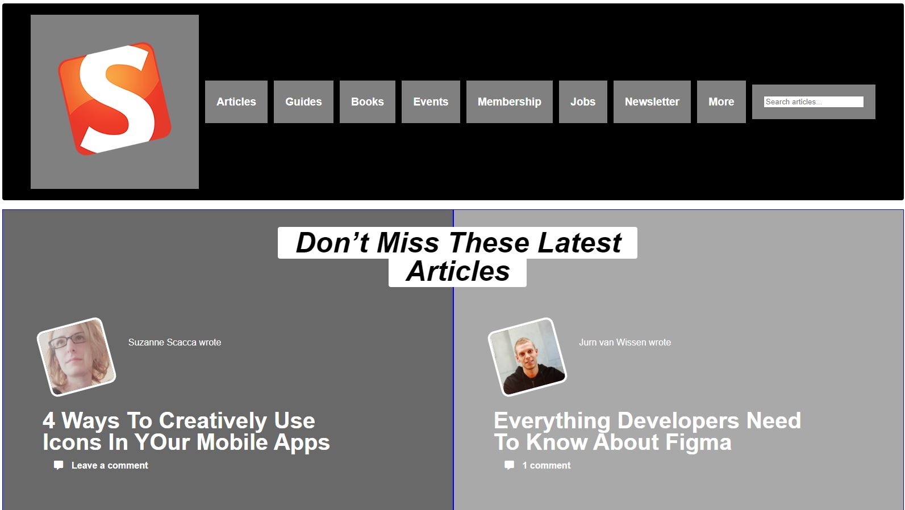

# Design Teardown

> Design an User Experience page.

We build a UX webpage with header, nav bar, body and footer section.

## Built With

- HTML
- CSS

## Live Demo

[Live Demo Link](https://deikdesign.github.io/design-teardown/)

## Authors

👤 **Deyan Todorov**

- GitHub: [@githubhandle](https://github.com/deikdesign)
- Twitter: [@twitterhandle](https://twitter.com/deikdesign)

👤 **Asadullah**

- GitHub: [@githubhandle](https://github.com/abmasadullah)
- Twitter: [@twitterhandle](https://twitter.com/abmasadullah)

## 🤝 Contributing

Contributions, issues, and feature requests are welcome!

Feel free to check the [issues page](issues/).

## Show your support

Give a ⭐️ if you like this project!

## Acknowledgments

- Hat tip to anyone whose code was used
- Inspiration
- etc

## 📝 License

This project is [MIT](lic.url) licensed.
